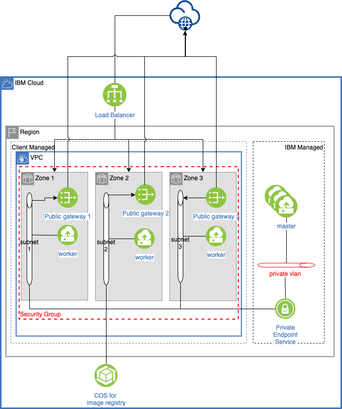

# IBM ROKS on VPC gen 2

The material in this directory allows to instanciate an IBM ROKS Cluster on VPC gen-2 infrastructure. It uses 3 zones of a region. 

This script creates :

* a COS instance used for the OCP registry
* a VPC 
* public gateways. one per zone (3).
* subnets. one per zone (3). Thesubnet is attached to the public gateway of the zone.
* security group authorizing workers communication
* ROKS cluster working on 3 zones. 
* worker pool (Optional need to uncomment some portuon of the script) 



This script should be executed with terraform 0.12, as required by IBM Cloud terraform provider plugin. cf: [Getting started with IBM Cloud Provider plug-in for Terraform](https://cloud.ibm.com/docs/terraform?topic=terraform-getting-started)


## Preapre the input variables

Create a `terraform.tfvars` file with your values of variables.

The varaibles you could set are:

 variable name | description | status 
 ------------- | --------------------- | ---
`ibmcloud_api_key` | the PAI key used to interact with IBM Cloud | Required 
`cos_service_name` | the name of the COS that will be created | Optional (default: *myservice*)
`cos_service_plan` | the plan of the COS isntance | Optional (default: *standard*)
`cluster_node_flavor` | the machine flavor (capacity) for worker creation | Optional (default: *bx2.16x64*)
`cluster_kube_version`| the version of installed container cluster | Optional (default: *4.5_openshift*)
`default_worker_pool_count` | the number of worker nodes created per zone | Optional (default:  *2*)
`region` | the region where the cluster will be deployed | Optional (default: *us-south*)
`resource_group` | The ressource group used for cluster creation | Optional (default: *default*)
`cluster_name` | the name of the created cluster | Optional (default: *cluster-roks-on-vpc*)
`worker_pool_name`| the name of worker pool | Optional (default : *workerpool*)
`entitlement`| the OCP entitlement. If ROKS is used for Cloud Pak instances, set this value to cloud_pak | Optional (default : *""*)

## Execute the scripts

Init your terraform env
``` 
terraform init
```

Check what you are willing to create 
```
terraform plan
``` 

Launch the deployment of resources
```
terraform apply 
```

## Destroy your instance

To destroy your instances 
``` 
terraform destroy  
``` 

