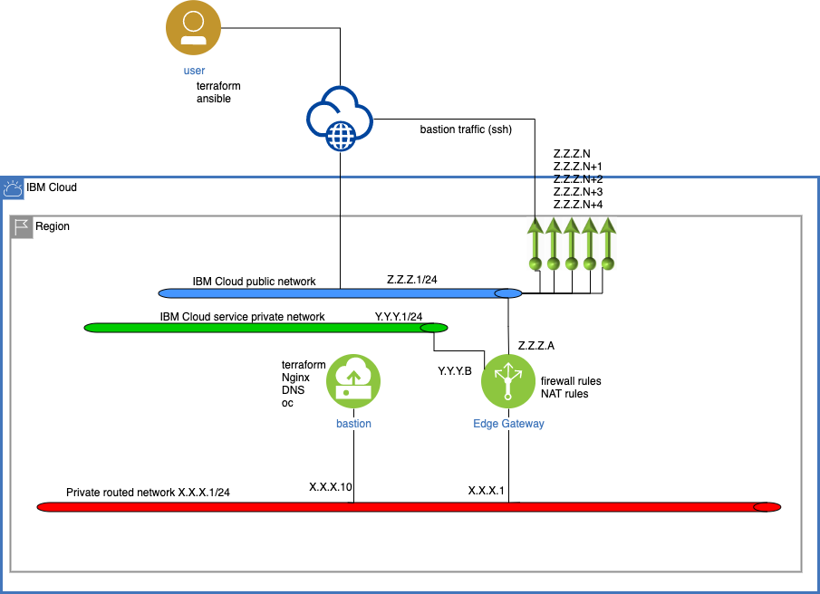

# Create a bastion vm on VCD

This terraform script is used to create a routed network and a bastion VM on IBM VCD.

It deploys the following architecture:

The bastion VM is configured with all the tools (oc , git terraform, Nginx ) that needed to deploy an Openshift cluster using terrforma script. The UPI terraform script could be located [here](https://github.com/slipsibm/terraform-openshift4-vcd).

## Prerequisites

You should have an IBM Cloud account. In your account, you have provisioned an VMware Solutions Shared. A `Datacenter` is created in vCloud Director. There are 5 public IP provisioned with this instance. The process, described in this guide, uses two of them. 

You should also get the information about how the edge gateway is to connected to external networks (IBM Cloud public and IBM cloud service private).

On your latop, you should have :

* terraform (>= v 0.13)
* ansible
* ssh-pass

In addition of these tools, you should have :

* ssh public key, placed in `$HOME/.ssh/id_rsa.pub. This ssh public key will be used to login on the bastion VM. 
* A file with Red Hat pull secret, used during OpenShift installation.

## Flow 

The flow, used by the script, is :

1. Create the routed net
2. Create a firewall rule and SNAT rules for outcoing traffic on IBM Cloud public network
3. Create a firewall rule and SNAT rules for outcoing traffic on IBM Cloud service private network
4. Create a Vapp
5. Associate the Vapp with routed network
6. Creat the firewall and NAT associtated 
7. Create the VM from the teample then customize it with static IP on routed network and password
8. Upload the ssh key ($HOME/.ssh/id_rsa.pub)
9. Launch script to extract values from terraforms.tfvars to populate `./bastion-vm/ansible/ansible_vars.json` variables file and `./bastion/ansible/inventory inventory` file.
10. Launch ansible script to 
    1. Enable RHEL subscription
    2. Configure DNS
    3. Install tools
    4. Install and configure Nginx
    5. copy pull-secret
    6. Install oc cli
    7. Install terraform cli
    8. Configure firewall
    9. Clone the UPI terrafor git repo

## Terraform variables

Before to launch, you may copy the `terraform.tfvars.example` file into `terraform.tfvars` file. then edit and change the value for your environment.

name | description | example 
---- | ----------- | -------
cd_user | the userid to access your VCD | admin
vcd_password | the password to access your VCD | XXXXXXXXXXXX
vcd_org | the targeted org of your VCD | 
vcd_url | the api url to access your VCD | https://fradir01.vmware-solutions.cloud.ibm.com/api
vcd_vcd | the id of your VCD | vcd-sw
edge_gateway | the name of the edge gateway in your VCD |  edge-fra04-94398dca
rhel_key | the RHEL subscription key provided with your VMware shared service | 
ocp_cluster | id of your ocp cluster | ocp
ocp_version | version of OCP cluster | 4.6   
domain | your network domain | mydomain.com
lb_ip | external IP where the load balancer in front of OCP cluster will be exposed | Z.Z.Z.56
terraform_ocp_repo | the git repo where the terroform for provising UPI of OCP | https://github.com/slipsibm/terraform-openshift4-vcd
bastion_ip | external IP where the bastion vm will be exposed | Z.Z.Z.55
external_net | name on the edge gateway of the IBM Cloud public network | fra04-w02-tenant-external
private_service_net | name on the edge gateway of the IBM Cloud service private network | fra04-w02-service01"
private_service_access_ip | IP of the edge gateway on the IBM Cloud service private network |  Y.Y.Y.B
ocp_console_ip | the IP adress of OCP console | Z.Z.Z.56
bastion_password | a password to acces to bastion VM (use only one time)" | 1CPpassw0rd#
outbound_ip | the IP of edge gateway on IBM cloud public network |  Z.Z.Z.A
routed_net  | Name of the routed net | ocpnet
internal_lb_ip | internal IP on routed net of laoad balancer | X.X.X.19
pull_secret_file | OCP pull secret file | ./pull_secret.txt